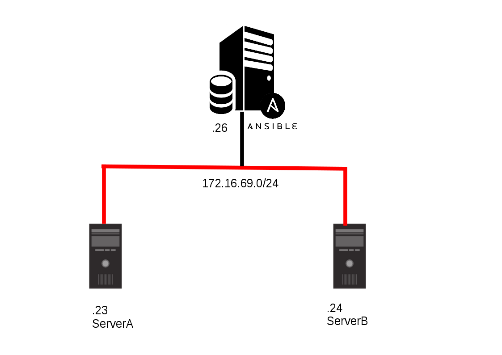

# Ansible Document
5/8/2017

## I. Diagram Architecture

- Ansible Control Node
```
Hostname: AnsibleCTL
IP: 172.16.69.26
Netmask: 255.255.255.0
GW: 172.16.69.1
```
- Managed Node
```
Hostname: ServerA
IP: 172.16.69.23
Netmask: 255.255.255.0
GW: 172.16.69.1
```
```
Hostname: ServerB
IP: 172.16.69.24
Netmask: 255.255.255.0
GW: 172.16.69.1
```
## II. Prequirement Config
- Install SSH (All Node)
```
yum -y install openssh-server
```
### Managed Node
- Create user acess SSH
```
[root@ServerA ~]# useradd ansible
[root@ServerA ~]# passwd ansible
Changing password for user ansible.
New password: 
Retype new password: 
[root@ServerA ~]# 
```
 - Add user to sudo (All Node)
```
[root@ServerA ~]# visudo
...
## Allow root to run any commands anywhere
root    ALL=(ALL)       ALL
ansible ALL=(ALL)       NOPASSWD:ALL
...
```
### Control Node
 - Create SSH Key
```
[root@AnsibleCTL ~]# ssh-keygen
Generating public/private rsa key pair.
Enter file in which to save the key (/root/.ssh/id_rsa): 
Enter passphrase (empty for no passphrase): 
Enter same passphrase again: 
Your identification has been saved in /root/.ssh/id_rsa.
Your public key has been saved in /root/.ssh/id_rsa.pub.
The key fingerprint is:
76:d4:09:a3:db:1a:f6:07:a1:69:d1:51:10:8f:a4:66 root@AnsibleCTL.local
The key's randomart image is:
+--[ RSA 2048]----+
|          B+.    |
|         = B .   |
|        E = +    |
|       o B .     |
|        S +      |
|       + = .     |
|        . . .    |
|           .     |
|                 |
+-----------------+
[root@AnsibleCTL ~]# 

```
 - Copy key to Managed Node
 ```
[root@AnsibleCTL ~]# ssh-copy-id root@172.16.69.23
The authenticity of host '172.16.69.23 (172.16.69.23)' can't be established.
ECDSA key fingerprint is eb:ca:31:3f:0b:8b:de:85:54:b7:13:12:e4:c6:d6:2c.
Are you sure you want to continue connecting (yes/no)? yes
/usr/bin/ssh-copy-id: INFO: attempting to log in with the new key(s), to filter out any that are already installed
/usr/bin/ssh-copy-id: INFO: 1 key(s) remain to be installed -- if you are prompted now it is to install the new keys
root@172.16.69.23's password: 

Number of key(s) added: 1

Now try logging into the machine, with:   "ssh 'root@172.16.69.23'"
and check to make sure that only the key(s) you wanted were added.
 ```
```
[root@AnsibleCTL ~]# ssh-copy-id root@172.16.69.24
The authenticity of host '172.16.69.24 (172.16.69.24)' can't be established.
ECDSA key fingerprint is eb:ca:31:3f:0b:8b:de:85:54:b7:13:12:e4:c6:d6:2c.
Are you sure you want to continue connecting (yes/no)? yes
/usr/bin/ssh-copy-id: INFO: attempting to log in with the new key(s), to filter out any that are already installed
/usr/bin/ssh-copy-id: INFO: 1 key(s) remain to be installed -- if you are prompted now it is to install the new keys
root@172.16.69.24's password: 
Permission denied, please try again.
root@172.16.69.24's password: 

Number of key(s) added: 1

Now try logging into the machine, with:   "ssh 'root@172.16.69.24'"
and check to make sure that only the key(s) you wanted were added.
```
 ## III. Install Ansible Control Node
 ```
 [root@AnsibleCTL ~]# yum install epel-release -y
 [root@AnsibleCTL ~]# yum update -y
	[root@AnsibleCTL ~]# yum install git python python-devel python-pip openssl ansible -y
 ```
 - Remove '#' at line:
 ```
[root@AnsibleCTL ~]# vi /etc/ansible/ansible.cfg
...
[defaults]
...
inventory      = /etc/ansible/hosts
...
sudo_user      = root
...
```
- Config host and group
```
[root@AnsibleCTL ~]# vi /etc/ansible/hosts
[controll]
172.16.69.26

[ServerA]
172.16.69.23

[ServerB]
172.16.69.24
```
